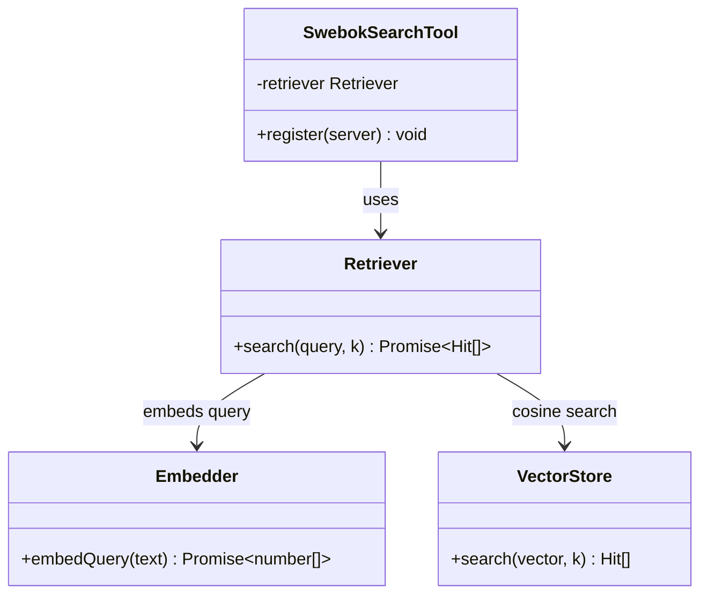
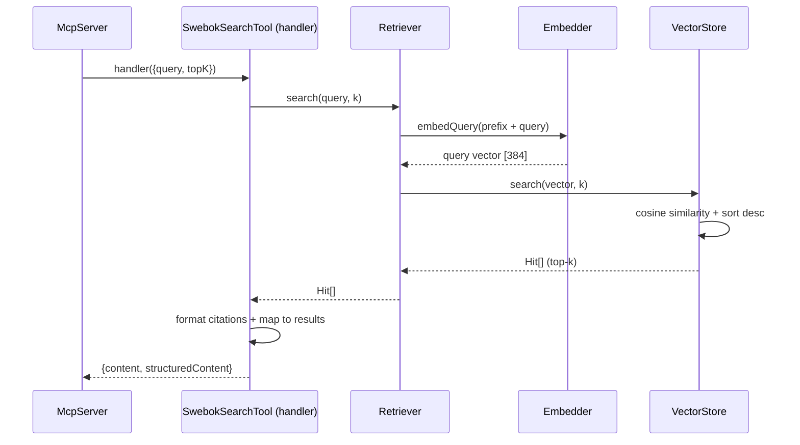

# MCP Tool: `swebok_search`

A **RAG** (Retrieval-Augmented Generation) search over the SWEBOK knowledge base.
The tool is **retrieval-only** — it returns the most relevant passages (chunks)
with citations, and the calling LLM synthesizes the final answer from them.

---

## 1. How it works (overview)

The tool turns the user's question into a vector and semantically searches for the
closest SWEBOK passages in an index built at server startup.

Flow of a single call:

1. **Input** — `query` (natural-language question) plus optional `topK`
   (how many passages to return, default 5).
2. **Query embedding** — the `Embedder` prepends the BGE prefix
   (`"Represent this sentence for searching relevant passages: "`) and computes a
   normalized 384-dimensional vector with the `Xenova/bge-small-en-v1.5` model
   (transformers.js, ONNX, fully in-process in Node — no Python).
3. **Search** — the `VectorStore` computes cosine similarity (dot product of
   normalized vectors) between the query and every chunk, returning the `topK`
   with the highest score.
4. **Formatting** — each matched chunk gets a citation
   `[Knowledge Area > topic, source pp.X-Y]` and its similarity score.
5. **Output** — the tool returns two representations:
   - `content` (text) — a human/LLM-readable summary with citations,
   - `structuredContent.results` — a structured array of hits (for programmatic
     use by the client).

> Note: the index (embeddings of all chunks) is built **once, at startup**. This
> makes the first call instant, and query and documents are embedded by the same
> code — the vectors live in one space.

### Input / output schema

| Field (input) | Type | Required | Description |
|---|---|---|---|
| `query` | `string` (min. 1 char) | yes | Question or search phrase. |
| `topK` | `int` 1–20 | no (default 5) | How many passages to return. |

| Field (`results[]`) | Type | Description |
|---|---|---|
| `rank` | `number` | Rank position (1 = best). |
| `score` | `number` | Cosine similarity (0–1, higher = closer). |
| `text` | `string` | Chunk text. |
| `ka_name` | `string \| null` | Knowledge Area (e.g. "Software Requirements"). |
| `topic_name` | `string \| null` | Topic (currently `null` — not mapped). |
| `source_id` | `string` | Source document identifier. |
| `page_start` / `page_end` | `number \| null` | Page range. |
| `section_heading` | `string \| null` | Section heading. |

---

## 2. Use Case

**Scenario:** an LLM answers the user's question *"What is requirements
elicitation?"*. Instead of guessing, it calls `swebok_search` to ground the answer
in authoritative SWEBOK text.

**Request (`tools/call`):**

```json
{
  "name": "swebok_search",
  "arguments": {
    "query": "What is requirements elicitation?",
    "topK": 3
  }
}
```

**Response (abridged):**

```json
{
  "content": [
    {
      "type": "text",
      "text": "#1 (score 0.781) [Software Requirements > (unmapped), swebok-v4-ch1 pp.6-8]\nThe goal of requirements elicitation is to surface candidate requirements ...\n\n#2 (score 0.741) [...]\n\n#3 (score 0.734) [...]"
    }
  ],
  "structuredContent": {
    "results": [
      {
        "rank": 1,
        "score": 0.781,
        "text": "The goal of requirements elicitation is to surface candidate requirements ...",
        "ka_name": "Software Requirements",
        "topic_name": null,
        "source_id": "swebok-v4-ch1",
        "page_start": 6,
        "page_end": 8,
        "section_heading": "..."
      }
    ]
  }
}
```

**What the LLM does next:** it reads the returned passages and synthesizes an
answer, e.g.:

> "Requirements elicitation is the process of discovering and gathering candidate
> requirements from stakeholders… (based on SWEBOK, *Software Requirements*,
> pp. 6–8)."

The citations (`ka_name`, `source_id`, pages) let the LLM point to its source and
let the user verify the answer.

---

## 3. Architecture

The tool is a thin handler; the retrieval work is delegated to a short chain of
collaborators. `SwebokSearchTool` holds a `Retriever`, which combines an
`Embedder` (query → vector) with a `VectorStore` (vector → nearest chunks).

> The vector index is prepared once at server startup; the tool assumes it is
> ready and only performs per-query lookups.

### 3.1. Components



### 3.2. Handling a single call



---

## 4. Source files

| File | Role |
|---|---|
| [`src/interface/mcp/tools/swebokSearchTool.ts`](../../src/interface/mcp/tools/swebokSearchTool.ts) | Tool class, input/output schema, handler. |
| [`src/application/retriever.ts`](../../src/application/retriever.ts) | Retrieval use case; `search(query, k)` over the ports. |
| [`src/domain/retrieval.ts`](../../src/domain/retrieval.ts) | Retrieval ports + policies (`figuresForRefs`, `citationOf`). |
| [`src/infrastructure/embedding/transformersEmbedder.ts`](../../src/infrastructure/embedding/transformersEmbedder.ts) | Query embedding via transformers.js (ONNX). |
| [`src/infrastructure/index/inMemoryVectorIndex.ts`](../../src/infrastructure/index/inMemoryVectorIndex.ts) | In-memory cosine search. |
| [`src/infrastructure/knowledgeBase/chunkFileSource.ts`](../../src/infrastructure/knowledgeBase/chunkFileSource.ts) | Loads `chunks.jsonl` (the searched corpus). |

---

## 5. Notes

- The query is embedded with the same `Xenova/bge-small-en-v1.5` model used to
  build the index, so query and passage vectors share one space.
- **`topic_name` is `null`** — topic mapping is not yet populated in the corpus;
  the Knowledge Area level (`ka_name`) works.
- `topK` defaults to `MCP_DEFAULT_TOP_K` (5) when the caller omits it.
